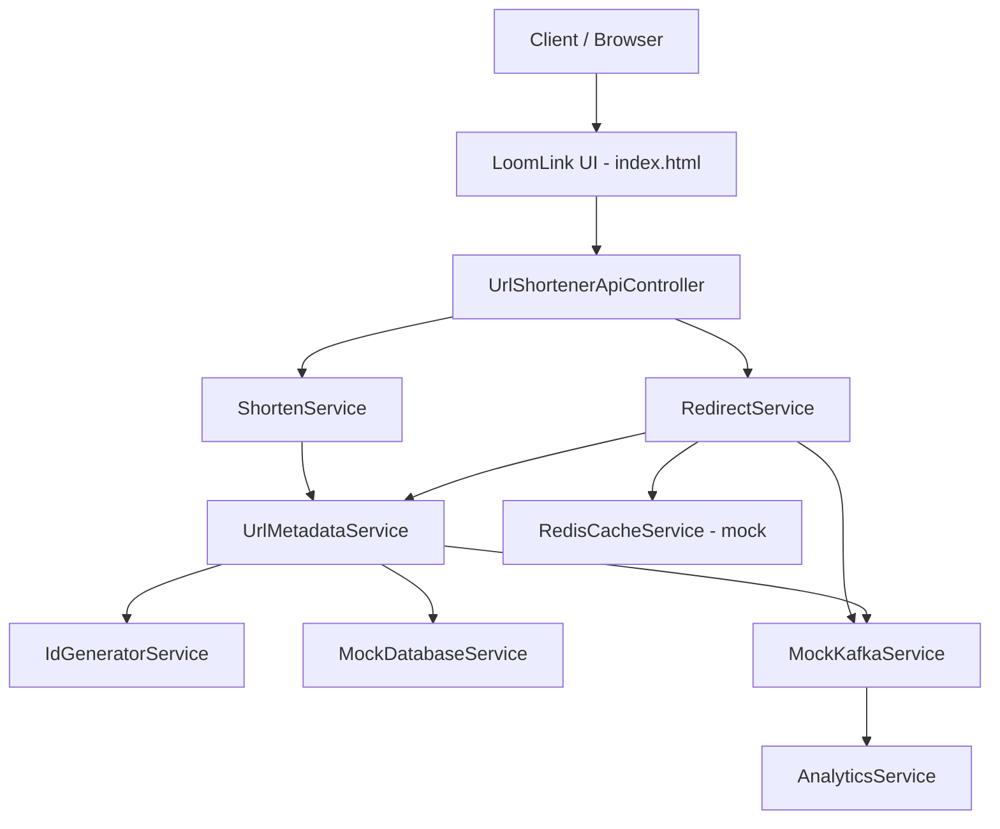

# LoomLink — URL Shortener & System Design Simulator

## Overview

**LoomLink** is a Spring Boot application that simulates a production-grade URL shortener. It implements the core read/write paths of a distributed system (cache, database, event streaming, analytics) using **in-memory mock services**, paired with an interactive web UI that visualizes request flow, cache behavior, and system state in real time.

This is an **educational / demo project** — Redis, Cassandra/DynamoDB, and Kafka are simulated in Java, not connected to real infrastructure.

| Property | Value |
|----------|-------|
| **Artifact** | `code.practice:URLShorten` |
| **Framework** | Spring Boot 3.5.16 |
| **Java** | 17 |
| **Server port** | 8081 |
| **UI** | `http://localhost:8081/` (served from `static/index.html`) |

---

## Purpose

The project demonstrates how a URL shortener is typically architected at scale:

- **Write path (shorten):** validate URL → generate unique ID → encode to Base62 → persist metadata → emit event
- **Read path (redirect):** check Redis cache → on miss, query database → populate cache → emit redirect event
- **Observability:** cache hit/miss metrics, LRU eviction, Kafka event log, analytics dashboard

The frontend ("LoomLink System Simulator") animates these flows on an architecture diagram and exposes internal state (cache contents, DB records, Kafka events).

---

## Tech Stack

| Layer | Technology |
|-------|------------|
| Backend | Spring Boot Web (`spring-boot-starter-web`) |
| Frontend | Vanilla HTML/CSS/JS, Chart.js, Font Awesome |
| Persistence (mock) | `ConcurrentHashMap` (simulates Cassandra/DynamoDB) |
| Cache (mock) | `LinkedHashMap` with LRU eviction (simulates Redis) |
| Messaging (mock) | `ConcurrentLinkedQueue` (simulates Kafka) |
| Testing | JUnit 5, `@SpringBootTest` |

---

## Architecture



### Simulated latencies

| Component | Simulated latency |
|-----------|-------------------|
| ID Generator | 5 ms |
| Redis cache | 3 ms |
| Database | 80 ms |
| Kafka delivery | 15 ms (async) |

---

## Project Structure

```
URLShorten/
├── pom.xml
├── src/main/
│   ├── java/code/practice/URLShorten/
│   │   ├── UrlShortenApplication.java      # Spring Boot entry point
│   │   ├── controller/
│   │   │   └── UrlShortenerApiController.java
│   │   ├── model/
│   │   │   ├── UrlMetadata.java
│   │   │   ├── RedirectResult.java
│   │   │   └── KafkaEvent.java
│   │   └── service/
│   │       ├── ShortenService.java
│   │       ├── RedirectService.java
│   │       ├── UrlMetadataService.java
│   │       ├── IdGeneratorService.java
│   │       ├── RedisCacheService.java
│   │       ├── MockDatabaseService.java
│   │       ├── MockKafkaService.java
│   │       └── AnalyticsService.java
│   └── resources/
│       ├── application.yaml                # port 8081
│       └── static/index.html               # LoomLink UI
└── src/test/java/.../UrlShortenApplicationTests.java
```

---

## Request Flows

### 1. Shorten URL (write path)

```
POST /api/shorten
  → ShortenService.shortenUrl()
    → validates URL (prepends https:// if missing)
    → UrlMetadataService.createShortUrl()
      → IdGeneratorService.nextId() + encode() → Base62 short key
      → MockDatabaseService.save()
      → MockKafkaService.publish("URL_SHORTENED", ...)
  ← UrlMetadata JSON (shortKey, longUrl, createdAt, expiresAt, clicks)
```

### 2. Resolve URL (read path — JSON trace for UI)

```
GET /api/resolve/{shortKey}
  → RedirectService.handleRedirect()
    1. RedisCacheService.get(shortKey)
    2. On CACHE MISS → UrlMetadataService.getUrl() → DB lookup
    3. On hit in DB → RedisCacheService.put() (cache-aside)
    4. MockKafkaService.publish("URL_REDIRECTED", ...)
  ← RedirectResult (longUrl, cacheHit, latencyMs, traceSteps[])
```

### 3. Real redirect (HTTP 302)

```
GET /r/{shortKey}
  → same RedirectService logic
  ← 302 Found with Location header, or 404 HTML
```

---

## API Reference

| Method | Endpoint | Description |
|--------|----------|-------------|
| `POST` | `/api/shorten` | Create a short URL. Body: `{ "longUrl": "...", "expirationDays": 7 }` |
| `GET` | `/api/resolve/{shortKey}` | Resolve key; returns JSON with trace steps (for UI) |
| `GET` | `/r/{shortKey}` | Perform actual HTTP redirect (302) |
| `GET` | `/api/system/state` | Inspect cache, DB, Kafka events, analytics |
| `POST` | `/api/system/clear` | Reset all in-memory state |

---

## Services

### `IdGeneratorService`
- Monotonic counter starting at `100018619L`
- Encodes IDs to **Base62** strings (`0-9`, `a-z`, `A-Z`)
- Supports encode/decode round-trip

### `UrlMetadataService`
- Orchestrates shorten: ID generation → DB save → Kafka event
- On lookup: fetches from DB and increments click counter

### `RedisCacheService`
- **LRU cache** with capacity of **5 keys** (intentionally small to demo eviction)
- Tracks hits, misses, and last evicted key
- Uses `LinkedHashMap` with `removeEldestEntry`

### `MockDatabaseService`
- In-memory `ConcurrentHashMap` keyed by `shortKey`
- Simulates ~80 ms DB latency per operation

### `MockKafkaService`
- In-memory event queue (max 50 events)
- Async delivery to `AnalyticsService.consume()`

### `AnalyticsService`
- Aggregates shorten/redirect counts
- Tracks clicks by URL, referer, and device (referer/device seeded with mock data; incremented randomly on redirects)

### `RedirectService`
- Core read-path logic with step-by-step **trace** for the UI
- On cache hit: async background DB touch (simulates eventual consistency)

---

## Data Models

### `UrlMetadata`
| Field | Type | Description |
|-------|------|-------------|
| `shortKey` | String | Base62 encoded key |
| `longUrl` | String | Original URL |
| `createdAt` | LocalDateTime | Creation timestamp |
| `expiresAt` | LocalDateTime | Expiration (default 7 days) |
| `clicks` | long | Click counter |

### `RedirectResult`
| Field | Type | Description |
|-------|------|-------------|
| `longUrl` | String | Resolved destination |
| `cacheHit` | boolean | Whether Redis had the key |
| `latencyMs` | long | End-to-end lookup time |
| `traceSteps` | List<String> | Human-readable flow log |

### `KafkaEvent`
| Field | Type | Description |
|-------|------|-------------|
| `id` | String | UUID |
| `type` | String | `URL_SHORTENED` or `URL_REDIRECTED` |
| `timestamp` | LocalDateTime | Event time |
| `details` | String | Event payload description |

---

## Frontend (LoomLink UI)

Served at **`http://localhost:8081/`** from `src/main/resources/static/index.html`.

Features:
- **Shorten** and **Trace & Redirect** forms
- **Architecture topology** SVG with animated request paths (shorten, cache hit, cache miss)
- **Real-time console** showing trace steps from the backend
- **Redis cache monitor** (contents, hit rate, eviction alerts)
- **Database records table** (short key, URL, clicks, created time)
- **Kafka event stream**
- **Analytics charts** (referer distribution, device share via Chart.js)
- **Reset Simulation** button → `POST /api/system/clear`

---

## Running the Application

```bash
# From project root
./mvnw spring-boot:run

# Or on Windows
mvnw.cmd spring-boot:run
```

Open **http://localhost:8081/** in a browser.

---

## Testing

```bash
./mvnw test
```

Tests cover:
- Spring context load
- Base62 encode/decode round-trip
- Mock DB save/retrieve
- Redis LRU eviction (capacity 5)
- Full shorten flow
- Redirect cache miss → cache hit sequence
- Non-existent key handling

---

## Design Notes & Limitations

**What is simulated (not real):**
- No actual Redis, Cassandra, DynamoDB, or Kafka connections
- All state is in-memory and lost on restart
- Expiration dates are stored but **not enforced** on redirect
- Analytics referer/device data is partially mocked/randomized

**Intentional demo behaviors:**
- Cache capacity of 5 to trigger LRU eviction visibly in the UI
- Artificial latencies to show performance difference between cache hit (~3 ms) vs DB miss (~80 ms+)
- Trace steps returned to power the frontend architecture animation

**Production gaps (if extending this project):**
- Add real Redis + persistent DB
- Enforce URL expiration
- Rate limiting, auth, custom aliases
- Horizontal scaling, CDN integration
- Proper Snowflake/Twitter-style distributed ID generation

---

## Quick Demo Workflow

1. Start the app (`mvnw spring-boot:run`)
2. Open `http://localhost:8081/`
3. Enter a long URL → click **Shorten** → watch the write-path animation
4. Click **Trace & Redirect** with the generated short key → observe cache miss on first lookup
5. Resolve the same key again → observe **REDIS_CACHE_HIT**
6. Shorten 6+ URLs and resolve them to trigger **cache eviction** (capacity 5)
7. Use **Reset Simulation** to clear all state
